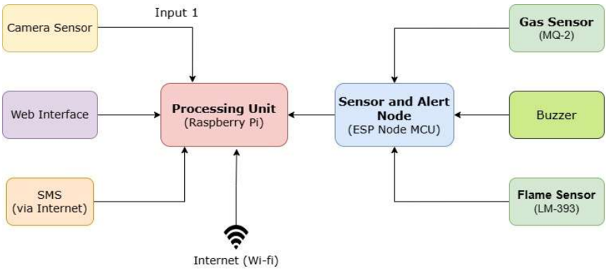
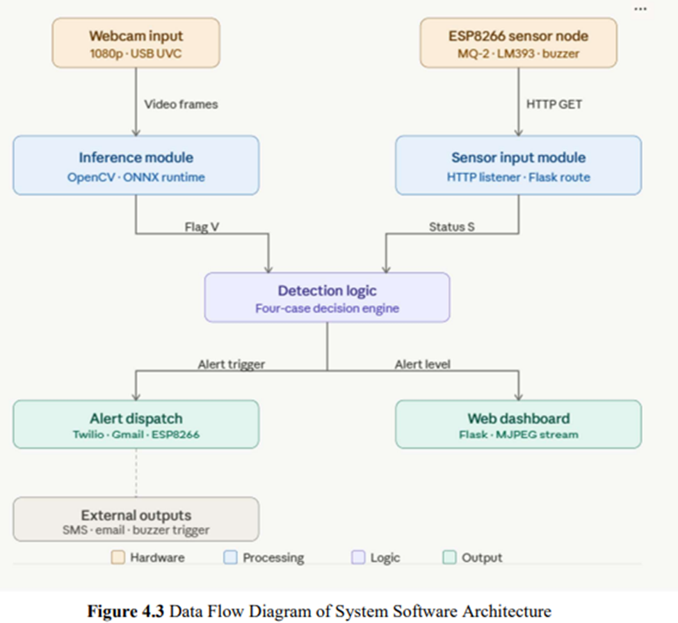
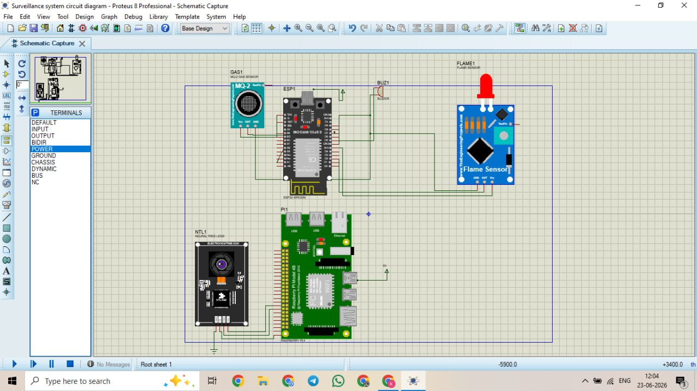
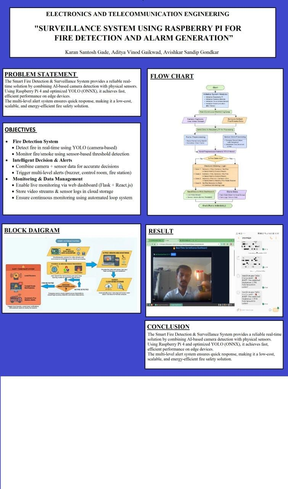

# Surveillance System Client Side

This repository contains the client-side / edge component of a fire and smoke surveillance system. It uses a Flask web server with OpenCV and an ONNX-based fire-detection model to stream a live camera feed and show detection results in the browser.

> Note: This folder is the client-side part of the project. The admin-side dashboard / backend logic is separate and is not included here.

## Project Overview

The system is designed for a Raspberry Pi or a local machine with a camera connected to:

- capture live video frames,
- run AI-based fire detection using a pre-trained ONNX model,
- stream the processed video to a browser,
- optionally expose a public URL through Cloudflare Tunnel,
- send detection alerts to a remote backend endpoint.

## Features

- Live MJPEG video stream in the browser
- AI fire detection using the ONNX model file `fire_detector.onnx`
- Bounding boxes drawn around detected fire regions
- Clear / Fire Detected status overlay on the stream
- Optional Cloudflare Tunnel integration for public access
- Alert forwarding to a backend endpoint for admin-side monitoring
- ESP8266 sensor code included for hardware-based fire/smoke alerts

## Project Structure

```text
surveillance-system-clientSide/
├── app.py                # Main Flask app for local / desktop usage
├── app_pi.py             # Raspberry Pi version with backend sync + tunnel support
├── demo.py               # Simple placeholder/demo script
├── fire_detector.onnx     # ONNX model used for inference
├── esp-code/             # Arduino / ESP8266 project files
│   ├── esp_code.ino
│   └── Readme.md
└── README.md             # Project documentation
```

## Requirements

### Python Packages

Install the following dependencies:

```bash
pip install flask opencv-python onnxruntime flask-cors requests numpy
```

### Hardware / Environment

- Python 3.8+
- Camera (USB webcam or Raspberry Pi camera if available)
- `fire_detector.onnx` file present in the project root
- Optional: Cloudflare Tunnel installed as `cloudflared`

## Running the Client-Side App

### Option 1: Run on a normal machine / desktop

```bash
python app.py
```

Then open:

```text
http://127.0.0.1:5000/
```

The app serves:

- `/` → HTML page with the live video stream
- `/video_feed` → MJPEG stream for the image element

### Option 2: Run on Raspberry Pi

```bash
python app_pi.py
```

This version is intended for Raspberry Pi and includes:

- camera access,
- AI inference,
- alert posting to a backend,
- Cloudflare Tunnel support for public link generation.

## How It Works

1. The app opens a camera source.
2. Frames are captured continuously.
3. The ONNX model processes each frame to detect fire-like objects.
4. Detected results are wrapped in bounding boxes and overlaid on the stream.
5. The processed frame is streamed through Flask as an MJPEG feed.
6. If enabled, the app can share the public stream URL with the backend/admin-side system.

## Admin-Side Note

The admin-side part of this system is not present in this repository. This project only handles:

- the camera stream,
- on-device AI detection,
- local browser output,
- optional alert delivery to an external admin/backend service.

If you are using a separate admin dashboard or backend, the client side should connect to it through the configured endpoint in `app_pi.py`.

## ESP8266 / Hardware Sensor Code

The `esp-code` folder contains an Arduino sketch for an ESP8266 NodeMCU-based fire/smoke detection setup.

It provides:

- smoke sensor reading,
- flame sensor reading,
- alert sending to a backend endpoint,
- buzzer control endpoints.

For detailed hardware instructions, open [esp-code/Readme.md](esp-code/Readme.md).

## Screenshots

The following images are already available in the project images folder:

- System block diagram
- Project flow chart
- Project circuit diagram

### Available images









## Notes

- The model file `fire_detector.onnx` must be present in the project directory.
- If no camera is found, the script may fail depending on the environment.
- For public access, install `cloudflared` and run the app with the tunnel-enabled version.
- The repository is meant for client-side/edge deployment and should be paired with the admin/backend service separately.

## Author

Karan Gade

## License

This project is intended for educational and demo purposes. Please adjust the license terms as needed for your own deployment.
